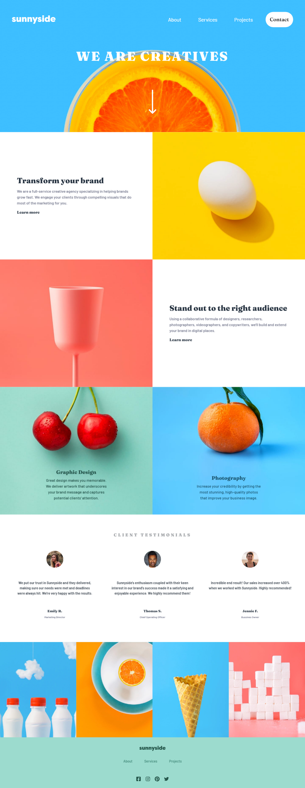

# Frontend Mentor - Sunnyside agency landing page solution

This is a solution to the [Sunnyside agency landing page challenge on Frontend Mentor](https://www.frontendmentor.io/challenges/sunnyside-agency-landing-page-7yVs3B6ef). Frontend Mentor challenges help you improve your coding skills by building realistic projects.

## Table of contents

- [Overview](#overview)
  - [The challenge](#the-challenge)
  - [Screenshot](#screenshot)
  - [Links](#links)
- [My process](#my-process)
  - [Built with](#built-with)
  - [What I learned](#what-i-learned)
  - [Continuos Development](#continuos-development)
  - [Useful resources](#useful-resources)
- [Author](#author)

## Overview

### The challenge

Users should be able to:

- View the optimal layout for the site depending on their device's screen size
- See hover states for all interactive elements on the page

### Screenshot

### Links

- Live Site URL: [Sunnyside](https://jlsoaresramos.github.io/sunnyside/)

## My process

### Built with

- Semantic HTML5 markup
- CSS custom properties
- Flexbox
- CSS Grid
- [React](https://reactjs.org/) - JS library
- [Vite](https://vitejs.dev/) - React framework
- [Tailwindcss](https://tailwindcss.com/) - For styles

### What I learned

In the course of my recent front-end project, delving into the TailwindCSS framework prompted profound reflections on the conventional wisdom of segregating CSS styles, HTML structure, and JavaScript scripts. This exploration offered insights into the exhilaration of TailwindCSS for styling, juxtaposed with the potential complexities it introduces.

TailwindCSS introduced me to the world of swift styling and predefined utility classes, providing an efficient avenue for design implementation. However, beneath the surface of this convenience, a realization surfaced—challenges emerge when styles intertwine with HTML components. While the immediacy of adjustments is tempting, it occasionally leads to intricate and less maintainable code. This experience compelled me to revisit the rationale behind the separation of concerns, emphasizing the importance of maintainability and collaboration within a team.

Amidst these reflections, the synergy between the Grid and Flexbox emerged as a beacon of efficiency for constructing layouts. The combination of these layout systems proved instrumental in achieving both complexity and responsiveness. The Grid offered precision in defining layouts, while Flexbox effortlessly managed dynamic content distribution and alignment, culminating in designs that seamlessly adapt across diverse screen sizes and devices.

In conclusion, this project encapsulates a journey of discovery. It underscores the balance between the expediency of TailwindCSS and the importance of code maintainability. Simultaneously, the strategic integration of Grid and Flexbox demonstrated the prowess of combining layout systems for optimal design flexibility.

### Continuos development

In the realm of continuous development, my recent front-end project prompted introspection into the effectiveness of creating reusable components. This journey exposed a realization: perhaps my approach to crafting reusable elements fell short, indicating a need for improvement, particularly in terms of scalability.

The development process, while dynamic and iterative, revealed gaps in my ability to generate components that transcend singular use cases. In retrospect, the absence of robust, reusable elements hindered the scalability of the project. This realization serves as a catalyst for recognizing the significance of scalable design patterns in fostering efficiency and maintainability.

To address this, the path forward involves a commitment to honing the skill of crafting modular and adaptable components. Embracing a mindset that prioritizes reusability not only enhances the current project but also lays the foundation for seamless scalability in future endeavors. The endeavor to create components that transcend specific instances contributes to a more sustainable and efficient development process.

### Useful resources

- [gh-pages](https://github.com/tschaub/gh-pages) - To deploy
- [CSS Tricks](https://css-tricks.com/snippets/css/css-triangle/) - To make a triangle for FloatNav

## Author

- Frontend Mentor - [@JLSoaresRamos](https://www.frontendmentor.io/profile/yourusername)
- [Linkedin](https://www.linkedin.com/in/jlramossoares/)
